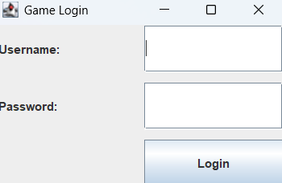
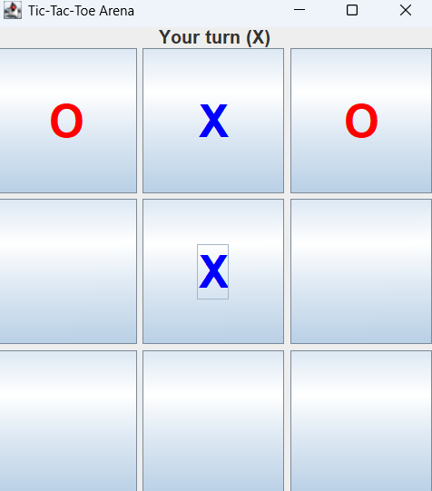
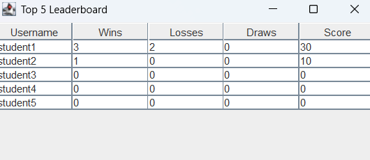

# Tugas Besar Pemrograman Fundamental - Game Tic-Tac-Toe Java Swing

## Data Mahasiswa
- **Nama:** Calcario Yusuf Endrokusumo
- **NRP:** 5026251185
- **Kelas:** Pemrograman Dasar (E)
- **Link Video Demo:** [Masukkan Link Video YouTube Lu di Sini]

## Deskripsi Proyek
Aplikasi ini adalah game Tic-Tac-Toe berbasis desktop menggunakan Java Swing GUI. Data pemain dan statistik game diintegrasikan dengan database MySQL melalui JDBC menggunakan arsitektur satu tabel (One-Table Rule) sesuai modul panduan.

## Dokumentasi GUI
Berikut adalah tampilan antarmuka dari aplikasi game:

### 1. Jendela Login

### 2. Arena Permainan Tic-Tac-Toe

### 3. Papan Peringkat (Top 5 Leaderboard)

## Fitur Utama
1. **Login Database:** Autentikasi user langsung mencocokkan username & password dari tabel database.
2. **Game Arena ($3\times3$):** Player (X) bertanding melawan Bot komputer (O) dengan validasi slot agar tidak bisa klik kolom yang sudah terisi.
3. **Statistik Real-time:** Menghitung jumlah menang ($+10$ poin), kalah ($+0$ poin), dan seri ($+3$ poin) yang otomatis ter-update ke database setelah game selesai.
4. **Top 5 Leaderboard:** Menampilkan peringkat 5 pemain dengan skor tertinggi menggunakan komponen `JTable`.

## Struktur Class
- `Main`: Entry point untuk menjalankan `LoginFrame` pertama kali.
- `DatabaseManager`: Mengatur koneksi JDBC Driver ke MySQL (Port `3307`, user `bn_processmaker`, password `d343ddc261`).
- `Player`: Model objek data untuk menyimpan *state* profil pemain di memori runtime.
- `playerService`: Handler query database untuk login, update skor, dan select Top 5.
- `GameLogic`: Logika inti game (cek menang/seri dan penentuan langkah bot).
- `GUI Frames`: Modul antarmuka (`LoginFrame`, `MainMenuFrame`, `GameFrame`, `StatisticsFrame`, `TopScorersFrame`).

## Cara Setup & Menjalankan Proyek
1. Nyalakan MySQL server lokal (XAMPP/Bitnami) di port `3307`.
2. Masuk ke phpMyAdmin, buat database baru bernama `game_project`.
3. Import file `schema.sql` yang ada di dalam folder `database` ke database tersebut.
4. Buka proyek ini di IntelliJ IDEA.
5. Pastikan `mysql-connector-j-9.x.x.jar` sudah dimasukkan ke modul Dependencies proyek.
6. Jalankan file `Main.java`.
